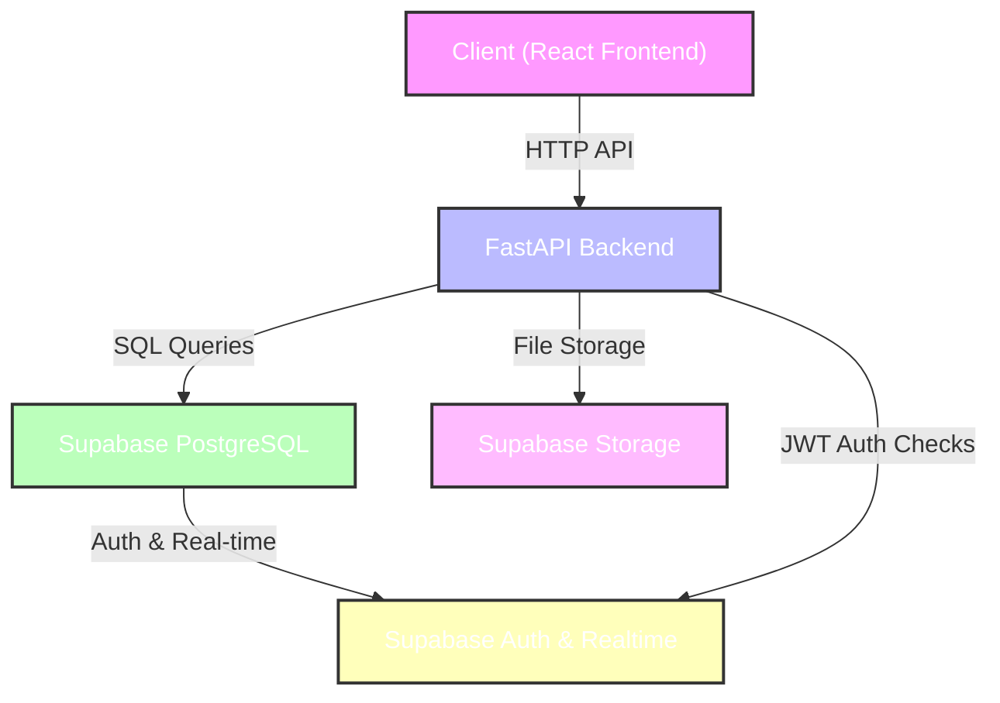

# Tech Stack & Architecture

## Justification
- **Frontend (React + Vite)**: We use React for building a dynamic and responsive user interface. Vite is used as the build tool for its extremely fast Hot Module Replacement (HMR) and optimized build process.
- **Backend (FastAPI)**: High‑performance Python web framework, easy to write async endpoints, automatic OpenAPI docs, and great for building RESTful APIs.
- **Database (Supabase)**: Managed PostgreSQL with built‑in authentication, real‑time sync, and storage. It provides a robust backend-as-a-service (BaaS) layer.
- **JWT Authentication**: We use JSON Web Tokens (JWT) for secure, stateless authentication between the frontend and backend. Supabase Auth handles the token generation, and FastAPI validates it for API access.
- **Why not MERN/PERN**: While MERN/PERN are popular, FastAPI ofrece superior performance and type safety (via Pydantic), while Supabase simplifies the infrastructure management compared to a self-hosted Express/Node setup.

## Project Boilerplate
A **Boilerplate** is a pre-configured template or starter kit that includes the essential folder structure, configuration files, and basic "Hello World" code needed to start development immediately. 

For this project, the boilerplate includes:
- **Backend**: FastAPI app structure with a health check endpoint and dependency list.
- **Frontend**: React project initialized with Vite, including basic routing and component structure.
- **DevOps**: Docker-ready configuration (optional), `.gitignore`, and GitHub Actions CI workflow.
- **Environment**: `.env.example` templates for local and production configuration.

## System Flow Diagram

The diagram illustrates the high‑level interactions between the client, FastAPI, and Supabase services.
